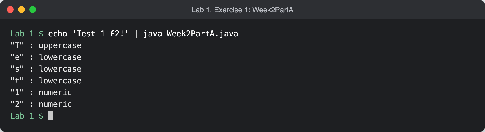
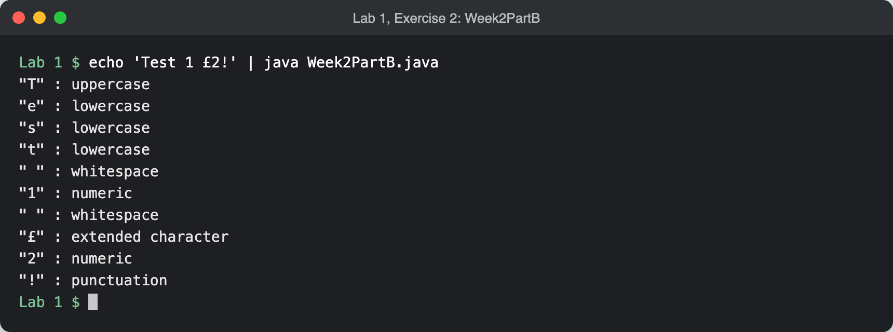
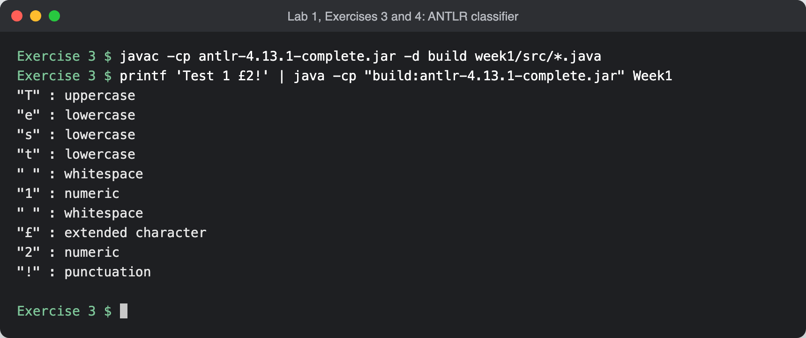
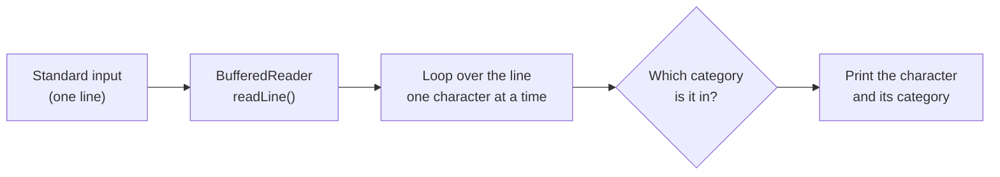
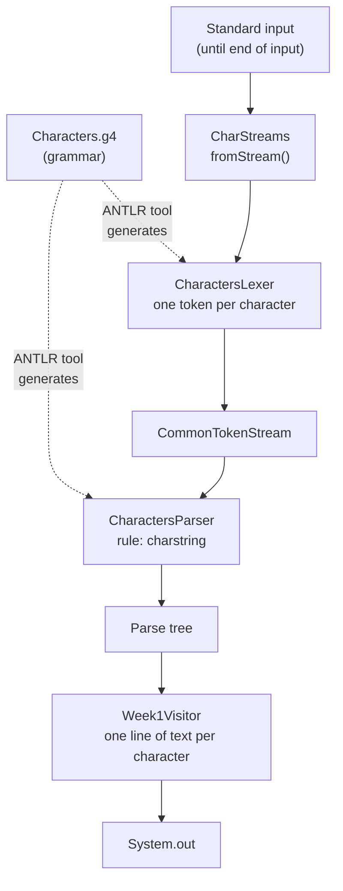

# Compilers and Computer Architecture

University work. Genuinely hand written, no AI here. You're watching me "learn" to code (and not amazingly well).

Coursework for the Year 2 university module Compilers and Computer Architecture, written in Java with one folder per lab. So far there is Lab 1: small programs that take in a text string and print the category of each character (upper case, lower case, numeric, whitespace, punctuation, extended or unprintable). Exercises 1 and 2 are a native implementation in Java, and Exercises 3 and 4 use the ANTLR library, with the categories written as grammar rules. Sorting characters into classes like this is the groundwork for a lexer, the part of a compiler that first reads the source code.

It is coursework, so it is here as a record of the labs rather than as a tool to use.

## Screenshots

Real runs from a fresh clone on macOS with JDK 26, all given the same sample input, `Test 1 £2!`. The terminal sessions were captured as text and rendered as images.



*Exercise 1 (`Week2PartA`) reports upper-case letters, lower-case letters and digits, and leaves everything else out.*



*Exercise 2 (`Week2PartB`) gives every character a category, including the spaces, the pound sign and the exclamation mark.*



*Exercises 3 and 4 (`Week1` with the `Characters.g4` grammar), compiled and run. The output matches Exercise 2.*

If you put "Test 1 £2!" through Exercise 2 or Exercises 3 and 4, you'll get this for an output:

```text
"T" : uppercase
"e" : lowercase
"s" : lowercase
"t" : lowercase
" " : whitespace
"1" : numeric
" " : whitespace
"£" : extended character
"2" : numeric
"!" : punctuation
```

## What's in Lab 1

| Exercise | Where | What it does |
| --- | --- | --- |
| 1 | `Lab 1/Week2PartA.java` | Reads one line and prints each upper-case letter, lower-case letter and digit with its category. Other characters are not printed. |
| 2 | `Lab 1/Week2PartB.java` | Reads one line and prints every character with one of the seven categories below. |
| 3 and 4 | `Lab 1/Exercise 3/` | The seven categories written as lexer rules in an ANTLR grammar, with a parse tree visitor that prints the result. Reads everything on standard input, not just one line. The folder holds the Exercise 4 version; the Exercise 3 version (upper case, lower case and digits only) is in the history at commit `286981e`. |

The categories:

| Category | Characters |
| --- | --- |
| uppercase | `A` to `Z` |
| lowercase | `a` to `z` |
| numeric | `0` to `9` |
| whitespace | space, tab and line break characters |
| punctuation | the printable ASCII symbols, such as `!`, `,`, `@` and `{` |
| extended character | anything outside ASCII, such as `£` or `é` |
| unprintable | anything else, such as other control characters |

## How to run

You need a JDK, version 11 or newer, with `java` and `javac` on your `PATH`. The commands below were tested on macOS with JDK 26. The ANTLR 4.13.1 jar (tool and runtime in one) is already in `Lab 1/Exercise 3`, so there is nothing else to download.

```sh
git clone https://github.com/LBSiUK/compilers-and-computer-architecture.git
cd compilers-and-computer-architecture
```

### Exercises 1 and 2

```sh
cd "Lab 1"
java Week2PartA.java
```

Type a line and press Enter. Use `Week2PartB.java` for Exercise 2. Java compiles a single-file program in memory when you run it like this, so no `.class` files are written. To pass the input in one go:

```sh
echo 'Test 1 £2!' | java Week2PartB.java
```

### Exercises 3 and 4 (ANTLR)

```sh
cd "Lab 1/Exercise 3"
javac -cp antlr-4.13.1-complete.jar -d build week1/src/*.java
java -cp "build:antlr-4.13.1-complete.jar" Week1
```

`Week1` reads until the end of the input, so type your text and then press Ctrl-D. If you press Enter first, the line break is listed as whitespace too. To pass the input in one go:

```sh
printf 'Test 1 £2!' | java -cp "build:antlr-4.13.1-complete.jar" Week1
```

The compiled classes go into `build/`, which git ignores. On Windows, use `;` instead of `:` in the classpath and Ctrl-Z then Enter to end the input (not tested).

The generated lexer and parser (`Characters*.java`) are committed, so you only need ANTLR itself after changing the grammar. To regenerate them:

```sh
cd "Lab 1/Exercise 3/week1/src"
java -jar ../../antlr-4.13.1-complete.jar -visitor -no-listener Characters.g4
```

### With Gradle (optional)

`Lab 1/Exercise 3` also has the module's Gradle build, whose `run` task passes your terminal input through to the program:

```sh
cd "Lab 1/Exercise 3"
gradle -q run
```

There is no Gradle wrapper, so this needs Gradle installed, running on a JDK that your Gradle version supports. Gradle 9.2.1 would not run on JDK 26 but works on JDK 21. The official Docker image was used to test it:

```sh
printf 'Test 1 £2!' | docker run --rm -i -v "$PWD":/work -w /work gradle:9.2.1-jdk21 gradle -q run
```

There are no automated tests.

## How it works

### Exercises 1 and 2



Each program is a single `main` method. It reads one line from standard input, walks through it a character at a time, works out the category from the character's code, and prints a line like `"T" : uppercase`. Exercise 1 knows three categories and skips anything else; Exercise 2 knows all seven, so every character gets a line.

### Exercises 3 and 4



Here the categories live in the grammar, `Characters.g4`, as one lexer rule each. The ANTLR tool turns the grammar into Java: a lexer, a parser and a visitor interface. `Week1.java` connects them. It reads standard input into a character stream, the lexer turns that into one token per character, and the parser checks the tokens against the `charstring` rule (one or more characters, then the end of the input) and builds a parse tree. `Week1Visitor` then visits the tree, returns a line of text such as `"£" : extended character` for each character, and `Week1` prints the joined result.

### Project layout

```text
.
├── README.md
├── docs/screenshots/                README images
└── Lab 1/
    ├── README.md                    notes for the lab
    ├── Week2PartA.java              Exercise 1
    ├── Week2PartB.java              Exercise 2
    └── Exercise 3/                  Exercises 3 and 4 (ANTLR)
        ├── antlr-4.13.1-complete.jar
        ├── LICENSE.txt              ANTLR licence
        ├── settings.gradle
        └── week1/
            ├── build.gradle
            └── src/
                ├── Characters.g4            grammar, one lexer rule per category
                ├── CharactersLexer.java     generated by ANTLR
                ├── CharactersParser.java    generated by ANTLR
                ├── CharactersVisitor.java   generated by ANTLR
                ├── CharactersBaseVisitor.java  generated by ANTLR
                ├── Week1.java               main: input, lexer, parser, visitor
                └── Week1Visitor.java        turns the parse tree into the output text
```

## Status

- Lab 1 (Exercises 1 to 4) is here. Later labs will get their own folders.
- The `£` in the examples needs a terminal that uses UTF-8.

## Credits

- [ANTLR](https://www.antlr.org/) 4.13.1 by the ANTLR Project, under the BSD 3-clause licence (see `Lab 1/Exercise 3/LICENSE.txt`).
- Exercise 3 started from the module's starter code: the ANTLR jar, the Gradle build files, `Week1.java`, and a grammar and visitor with a single upper-case rule.
